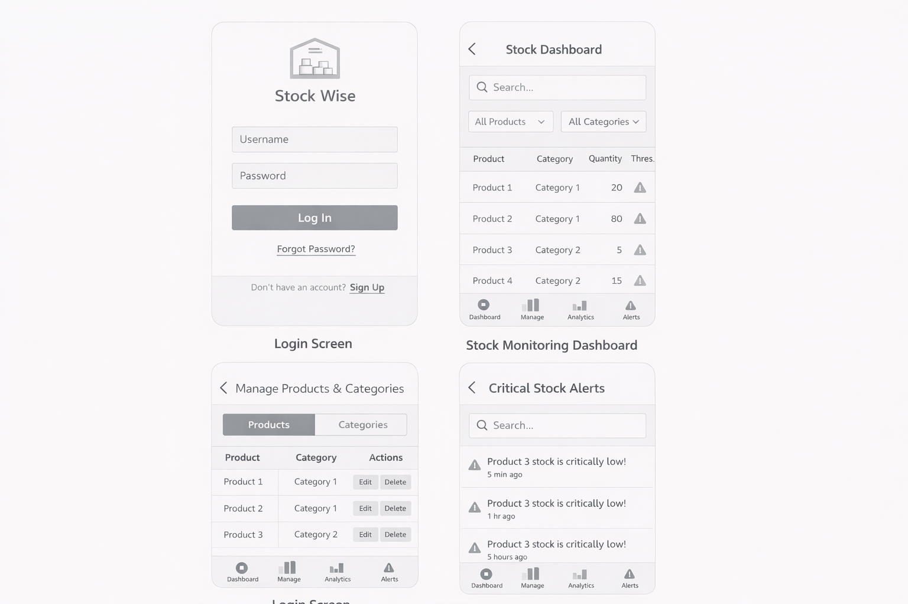

# StockWise - Smart Inventory & Stock Tracking System

This repository contains end-to-end documentation and architectural artifacts for the **StockWise** project.
The primary goal is to reduce errors, delays, and visibility problems caused by manual inventory tracking in small and medium-sized businesses through a web-based system.

> Note: This repository is currently structured mainly as a **documentation repository**. The target folder structure for the codebase is also defined in the installation document (`backend`, `frontend`, `docs`, `scripts`).

## 1) Work Breakdown and Team Structure

### Team roles
- **Zehra Berre Akyüz — Project Manager**
  - Roadmap, 14-week planning, Jira sprint/tracking, risk and resource management
- **Tuba Eraslan — Backend Lead**
  - PostgreSQL schema design, Spring Boot API development, business rules, and security integration
- **Ceren Şengül — Frontend Lead**
  - React-based dashboard, UI components, Axios integration, and chart screens
- **Can Tasar — QA & Documentation**
  - UML models, test planning and execution, bug tracking, final documentation, and repository organization

### Jira board
- SCRUM board: [https://zehraberr.atlassian.net/jira/software/projects/SCRUM/boards/1]

### 14-week project plan (summary)
1. **Initiation (Weeks 1-2):** Project definition, role allocation, Jira setup
2. **Analysis (Weeks 3-4):** Requirements analysis, UML drafts
3. **Design (Weeks 5-6):** Database schema, UI/UX design
4. **Development (Weeks 7-10):** Backend API + frontend integration
5. **Testing (Weeks 11-12):** QA, test execution, bug fixes
6. **Delivery (Weeks 13-14):** GitHub delivery, final presentation

## 2) Project Overview

### Problem
- Manual inventory management causes data entry errors, overstock/understock issues, and operational delays.
- Lack of real-time visibility increases the risk of financial loss.

### Solution
StockWise is a web-based inventory management platform that provides:
- **Real-time stock tracking**
- **Threshold-based low-stock alerts**
- **Analytics dashboards and charts**
- **Role-based authorization (Admin/Staff)**

### Target users
- Small and medium-sized businesses
- Warehouse managers/operators
- Retail operations teams

## 3) Scope and Functional Modules

### Authentication and user management
- User login / logout
- Role-based access (Admin, Staff)
- Prevention of unauthorized access

### Product and category management
- Add, update, and delete products (primarily Admin permissions)
- Category CRUD operations
- Search, filtering, and pagination

### Stock and alert management
- Real-time stock quantity monitoring
- Automatic alert generation for below-threshold items
- Alert history and active alert list

### Analytics and reporting
- Stock summary dashboard
- Category-based distribution and low-stock reports
- Bar/line/pie charts (Chart.js)

## 4) Technical Architecture Summary

### 4.1 Technology stack (compiled from documents)
- **Backend:** Java 21, Spring Boot, Spring Web, Spring Data JPA/Hibernate, Spring Security
- **Frontend:** React.js 18, Tailwind CSS, Axios
- **Database:** PostgreSQL 15+
- **Testing:** JUnit 5, Mockito, Spring Boot Test, manual test scenarios
- **Process/tools:** Jira, Git/GitHub, Draw.io, Maven, npm/Vite

### 4.2 Layered application approach
- **Controller layer:** HTTP/API entry points
- **Service layer:** Business rules (stock calculations, alert triggering, etc.)
- **Repository layer:** Data access operations
- **Data model:** USERS, PRODUCTS, CATEGORIES, ALERTS

### 4.3 Security architecture
- **RBAC:** hierarchy of `ROLE_ADMIN` and `ROLE_STAFF`
- **Least Privilege:** users can only access resources required for their responsibilities
- **Protection mechanisms:** BCrypt password hashing, SQL injection mitigation (JPA parameter binding), CSRF protection, HTTPS/TLS, auditing approach
- **Application-layer access control:** authorization checks at URL + method + view (UI) levels

### Architecture note (across documents)
The document set includes two different security/session approaches:
- Some documents describe **session-based + Thymeleaf SSR**,
- Technical requirements/installation documents describe **React + REST + JWT**.

This README combines the common parts of both approaches to provide a general picture. Once the implementation is finalized, it is recommended to standardize a single approach with an ADR (Architecture Decision Record).

## 5) API and Data Model Summary

### Example API groups
- `POST /api/auth/login`
- `GET /api/products`, `POST /api/products`, `PUT /api/products/{id}`, `DELETE /api/products/{id}`
- `GET /api/categories`, `POST /api/categories`
- `GET /api/alerts`, `GET /api/alerts/active`

### Core entities
- **USERS:** user, role, credential fields
- **PRODUCTS:** product name, quantity, threshold, price, category
- **CATEGORIES:** product groups
- **ALERTS:** critical stock alerts and timestamps

## 6) Performance and Quality Expectations

- API responses should target **under 500ms** under normal load.
- Frontend dashboard loading should target **under 2 seconds**.
- As a security requirement, access token lifetime is **1 hour**, and refresh token lifetime is **7 days**.
- The production reliability target stated in documents is **99% uptime**.
- To maintain sustainability, layered architecture, test coverage, and documentation standards should be preserved.

## 6.5) MVP Implementation Summary

### Backend Development (Spring Boot)
The backend API has been fully implemented with the following components:

**Core Modules:**
- **Category Management** (`/api/categories`)
  - CRUD operations: Create, Read, Update, Delete categories
  - Duplicate name validation
  - Category repository and service layers
  
- **Product Management** (`/api/products`)
  - CRUD operations for products with category associations
  - Low-stock flag calculation (quantity ≤ threshold)
  - Product search and listing
  - Price and quantity tracking

- **Stock Alerts** (`/api/alerts/active`)
  - Real-time low-stock alert monitoring
  - Dynamic calculation of alerts based on current inventory
  - Alert severity and shortage quantity calculation
  - Auto-refresh every 5 seconds on frontend

**Infrastructure:**
- **Global Exception Handler** - Centralized error handling with standardized API responses
- **Seed Data Initialization** - Auto-generated demo data (2 categories + 2 products) on startup
- **H2 In-Memory Database** - Default development database (no PostgreSQL required locally)
- **PostgreSQL Support** - Production-ready with environment variable override
- **Spring Security** - HTTP Basic authentication (temporarily permitAll for demo mode)

**Database Models:**
- Category: id, name, description
- Product: id, name, quantity, threshold, price, categoryId (FK), lowStock (computed)

**Technologies:** Java 21, Spring Boot 4.0.4, Spring Data JPA/Hibernate, Lombok, Jackson

### Frontend Development (React + Axios)
A professional, modern dashboard-based UI with responsive design:

**Core Components:**
- **Dashboard** - Main layout with navigation tabs and live statistics (category count, product count, active alerts)
- **Category List** - Browse and add new product categories with description
- **Product List** - Full CRUD for products; table view with status badges (Normal/Low Stock)
- **Alert List** - Real-time monitoring of low-stock items with shortage calculations
- **API Service Layer** - Axios-based HTTP client with all CRUD function exports

**UI/UX Features:**
- **Professional Design** - Gradient navbar (#667eea → #764ba2), modern color scheme
- **Responsive Grid Layout** - Auto-fitting card layouts for mobile, tablet, and desktop
- **Live Alerts** - Auto-refresh every 5 seconds; visual indicators for low-stock items
- **Form Validation** - Input validation and user feedback
- **Bootstrap 5 CDN** - No build wrapper needed; clean, accessible styling

**Technologies:** React 18, Axios, Bootstrap 5 CDN, CSS3 with Flexbox/Grid

### Implementation Highlights
✅ Backend API fully functional with all CRUD endpoints  
✅ Frontend components rendering API data in real-time  
✅ No external dependencies for database (H2 in-memory)  
✅ Professional, intuitive user interface  
✅ Responsive design working on all screen sizes  
✅ Live alert monitoring with auto-refresh  
✅ Clean separation of concerns (Service → Controller → Component)

---

## 7) How to Run (Local Development)

### ⚡ Quick Start (No Database Required!)

For **fastest local testing**, use H2 in-memory database (default configuration):

```bash
# Terminal 1: Start Backend
cd backend
mvn spring-boot:run
# Backend running at: http://localhost:8080

# Terminal 2: Start Frontend  
cd frontend
npm start
# Frontend running at: http://localhost:3000 (auto-opens in browser)
```

✅ **Done!** Backend has seed data pre-loaded. Start using the app immediately.

---

### Prerequisites (For Productions / Full Setup)
- **Java JDK 21** ([download](https://www.oracle.com/java/technologies/downloads/#java21))
  - Verify: `java -version`
- **Maven 3.8+** (usually bundled with IDEs)
  - Verify: `mvn -v`
- **Node.js 18+ and npm** ([download](https://nodejs.org/))
  - Verify: `node -v && npm -v`
- **PostgreSQL 15+** ([download](https://www.postgresql.org/download/))
  - Verify: `psql --version`
- **Git** ([download](https://git-scm.com/))

### Step 1: Database Setup

#### Option A: H2 In-Memory (Recommended for Development)
**No setup required!** Backend automatically uses H2 in-memory database with seed data.
- Pros: Zero configuration, portable, includes demo data
- Cons: Data lost on restart (development only)

#### Option B: PostgreSQL (For Production)

```bash
# Start PostgreSQL service
# macOS (Homebrew): brew services start postgresql
# or use PostgreSQL.app

# Connect to PostgreSQL
psql -U postgres

# Create database and user
CREATE DATABASE stockwise_db;
CREATE USER stockwise_user WITH PASSWORD 'stockwise_pass';
ALTER ROLE stockwise_user SET client_encoding TO 'utf8';
ALTER ROLE stockwise_user SET default_transaction_isolation TO 'read committed';
ALTER ROLE stockwise_user SET default_transaction_deferrable TO on;
ALTER ROLE stockwise_user SET timezone TO 'UTC';
GRANT ALL PRIVILEGES ON DATABASE stockwise_db TO stockwise_user;
\q
```

Set environment variable to enable PostgreSQL:
```bash
export DB_URL=jdbc:postgresql://localhost:5432/stockwise_db
```

### Step 2: Configure Backend (application.properties)

**No configuration needed for H2!** Default `application.properties` is already set to use H2 in-memory.

For PostgreSQL production setup, edit `backend/src/main/resources/application.properties`:

```properties
# H2 Database (Default - Development)
spring.datasource.url=jdbc:h2:mem:stockwise
spring.datasource.driverClassName=org.h2.Driver
spring.jpa.database-platform=org.hibernate.dialect.H2Dialect

# PostgreSQL Database (Override with environment variable)
# spring.datasource.url=jdbc:postgresql://localhost:5432/stockwise_db
# spring.datasource.username=stockwise_user
# spring.datasource.password=stockwise_pass
spring.jpa.hibernate.ddl-auto=update
spring.jpa.show-sql=false

# Server Port
server.port=8080
```

Set `DB_URL` environment variable to switch to PostgreSQL:
```bash
export DB_URL=jdbc:postgresql://localhost:5432/stockwise_db
```

### Step 3: Build and Run Backend

```bash
cd backend

# Clean and compile
mvn clean compile

# Build and run tests
mvn clean package

# Start Spring Boot application
mvn spring-boot:run
# OR use pre-built JAR:
java -jar target/backend-0.0.1-SNAPSHOT.jar
```

**Backend will be running at:** `http://localhost:8080`  
**Health check:** `curl http://localhost:8080/actuator/health`

### Step 4: Build and Run Frontend

```bash
cd frontend

# Install dependencies
npm install

# Start development server
npm start
# OR build for production:
npm run build
```

**Frontend will be running at:** `http://localhost:3000`

### Step 5: Verify MVP (Core Flow)

1. **Open browser:** `http://localhost:3000`
2. **Explore Dashboard:** View statistics and welcome message
3. **Browse Categories:** Check pre-loaded categories (Electronics, Office Supplies)
4. **View Products:** See seed products with stock levels
5. **Add New Product:**
   - Name: `Test Product`
   - Category: `Electronics`
   - Quantity: `2`
   - Threshold: `5`
   - Price: `99.99`
   - Click "Add"
6. **Check Alerts:** Navigate to Alerts tab → See newly added product highlighted (quantity < threshold)
7. **Real-time Monitoring:** Alerts auto-refresh every 5 seconds

**Demo Data (Pre-loaded):**
- Categories: Electronics, Office Supplies
- Products: Laptop (qty: 10, threshold: 5), Pen (qty: 2, threshold: 10)
- Alerts: Pen shows as low-stock (2 < 10)

### Troubleshooting

| Issue | Solution |
|-------|----------|
| Backend won't start | Check if port 8080 is free; use `lsof -i :8080` to find conflicting process |
| H2 'database already in use' | Disable devtools restart in `application.properties`: `spring.devtools.restart.enabled=false` |
| Frontend API calls fail (CORS) | Backend runs on 8080, frontend on 3000 - CORS already configured |
| `Port 8080 already in use` | Kill existing process: `lsof -i :8080 \| grep LISTEN \| awk '{print $2}' \| xargs kill -9` |
| `Port 3000 already in use` | Use `npm start -- --port 3001` |
| Database connection fails | For PostgreSQL: verify credentials and service is running; for H2: no setup needed |
| `mvn: command not found` | Add Maven to PATH or use `./mvnw` (included wrapper) |
| Frontend can't reach backend | Verify backend is running (`curl http://localhost:8080/api/categories`); check Axios URL in `src/services/api.js` |
| Seed data not appearing | Restart backend; verify `DataInitializer.java` is loading |

## 8) Installation and Deployment Summary (Production)

### Production Deployment Architecture
- Backend JAR build and frontend production bundle processes are separate.
- Environment variables (`SPRING_DATASOURCE_*`, `REACT_APP_API_BASE_URL`, `JWT_SECRET`) must be managed securely via **environment files or secrets management tools** (not hardcoded).
- Default account/password credentials must be changed in production environments.
- HTTPS/TLS must be enforced for all communications.
- Database backups and disaster recovery procedures should be documented.

## 9) Document Map

Purpose of the main documents in this repository:
- `Project Overview.pdf`: project goals, scope, and team roles
- `StockWise-Report.pdf`: technical task distribution and team-based work breakdown
- `Software project management.xlsx`: resources, phases, and the 14-week plan
- `StockWise_TechnicalRequirements.pdf`: FR/NFR, technology, API, and testing requirements
- `Technology_stack.pdf`: architectural foundation and backend/data access decisions
- `Security_architecture.pdf`: defense layers and security controls
- `CODE SECURITY AND DATA PRIVACY.pdf`: secure coding, data privacy principles, and protection responsibilities
- `Role_and_authorization_management.pdf`: RBAC and authorization policies
- `Clearance_level_system.pdf`: role hierarchy and clearance model
- `StockWise_InstallationDeployment.pdf`: installation, execution, deployment, and troubleshooting
- `Implementation Roadmap.pdf`: implementation timeline and milestone-based delivery roadmap
- `Risk Assessment and Management.pdf`: identified risks, impact/probability evaluation, and management approach
- `Risk Matrix.pdf`: risk prioritization matrix based on likelihood and impact scoring

## 10) MVP User Interface Screenshots

### Dashboard Overview - Main Statistics Page


**Features shown:**
- Professional gradient navbar with StockWise branding
- Real-time statistics cards (Total Categories, Total Products, Active Alerts)
- Welcome message with system information
- Quick tips and navigation guidance

### Category Management - Add & Browse Categories


**Features shown:**
- Add new category form with name and description
- Category cards grid layout
- Clean, card-based presentation of all categories
- Professional styling with hover effects

### Product Management - Full CRUD Interface


**Features shown:**
- Comprehensive product form (name, category, quantity, threshold, price)
- Products table with stock status indicators
- Color-coded low-stock warnings (red for low, green for normal)
- Category dropdown selection for product association

### Active Alerts - Low Stock Monitoring


**Features shown:**
- Real-time low-stock alert cards with warning icons
- Shortage quantity calculation and display
- Category and current stock information
- Color-coded alert cards with visual hierarchy
- Helpful tip about stock replenishment

---
- `Mitigation.pdf`: mitigation strategies and preventive/corrective action plan for key risks
- `Payroll.pdf`: payroll-related process/role documentation linked to operational workflow
- `architecture.png`, `auth_flow.png`, `rbac.png`, `project-diagram.drawio.png`: visual architecture and flow artifacts
- `F6EB5E3F-DC1A-4629-9361-BD9055B12140.png`: end-to-end UI snapshot (login, product/category management, dashboard, and alert flow)

## 10) Diagrams

### Overall architecture


### Authentication flow


### RBAC view


### Project diagram


### End-to-end UI snapshot
`F6EB5E3F-DC1A-4629-9361-BD9055B12140.png` presents a single, stitched overview of core StockWise screens: the login page, product and category management table, stock monitoring dashboard (with search/filter controls), and the critical stock alert panel. This visual helps explain how authentication, daily operations, analytics, and alert handling are connected in one user journey.




