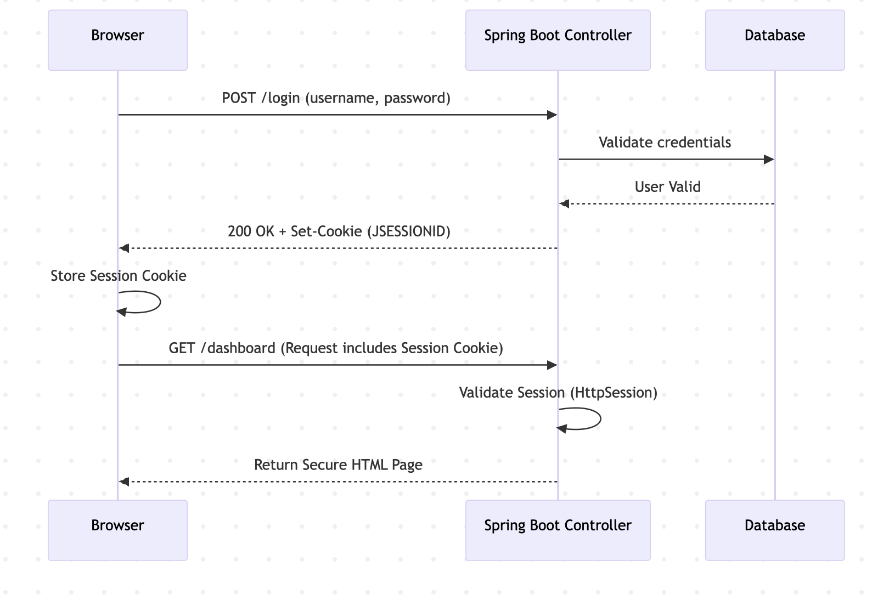
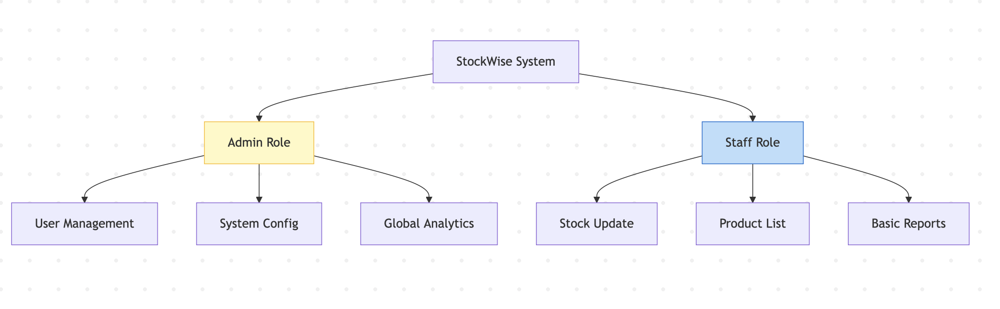
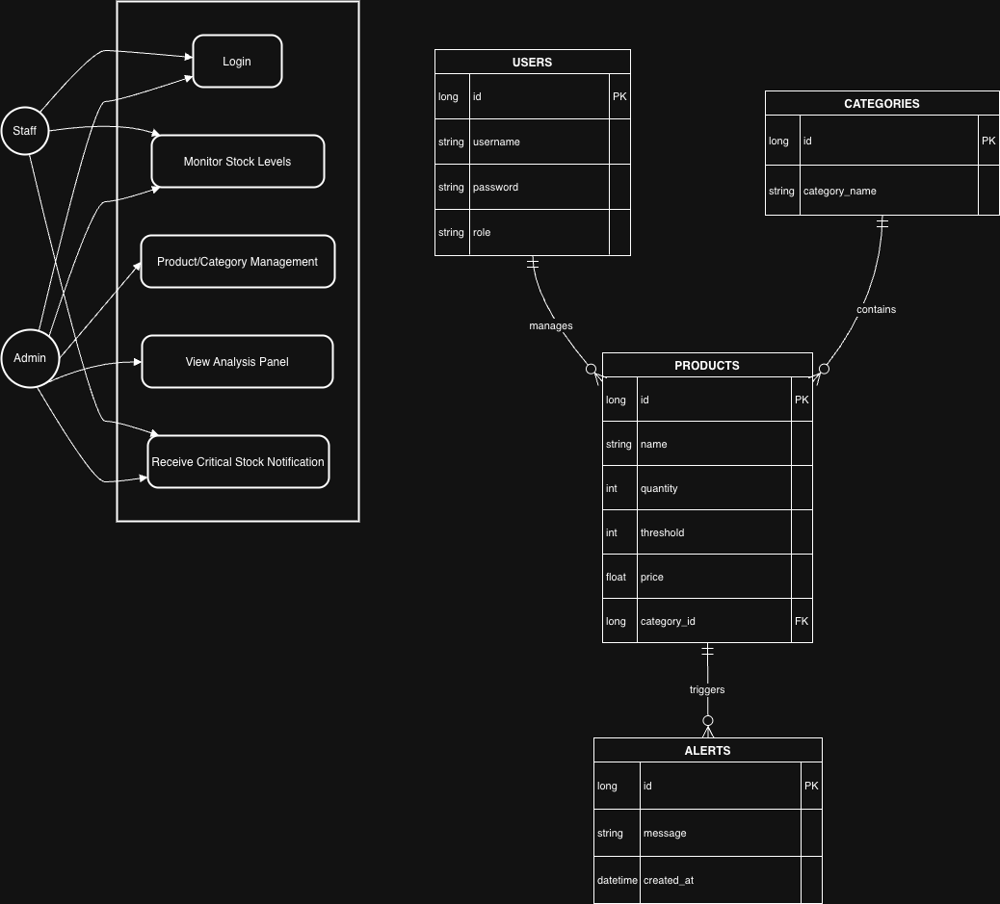

# StockWise - Smart Inventory & Stock Tracking System

This repository contains end-to-end documentation and architectural artifacts for the **StockWise** project.
The primary goal is to reduce errors, delays, and visibility problems caused by manual inventory tracking in small and medium-sized businesses through a web-based system.

> Note: This repository is currently structured mainly as a **documentation repository**. The target folder structure for the codebase is also defined in the installation document (`backend`, `frontend`, `docs`, `scripts`).

## 1) Work Breakdown and Team Structure

### Team roles
- **Zehra Berre Akyüz — Project Manager**
  - Roadmap, 14-week planning, Jira sprint/tracking, risk and resource management
- **Tuba Eraslan — Backend Lead**
  - PostgreSQL schema design, Spring Boot API development, business rules, and security integration
- **Ceren Şengül — Frontend Lead**
  - React-based dashboard, UI components, Axios integration, and chart screens
- **Can Tasar — QA & Documentation**
  - UML models, test planning and execution, bug tracking, final documentation, and repository organization

### Jira board
- SCRUM board: [https://zehraberr.atlassian.net/jira/software/projects/SCRUM/boards/1]

### 14-week project plan (summary)
1. **Initiation (Weeks 1-2):** Project definition, role allocation, Jira setup
2. **Analysis (Weeks 3-4):** Requirements analysis, UML drafts
3. **Design (Weeks 5-6):** Database schema, UI/UX design
4. **Development (Weeks 7-10):** Backend API + frontend integration
5. **Testing (Weeks 11-12):** QA, test execution, bug fixes
6. **Delivery (Weeks 13-14):** GitHub delivery, final presentation

## 2) Project Overview

### Problem
- Manual inventory management causes data entry errors, overstock/understock issues, and operational delays.
- Lack of real-time visibility increases the risk of financial loss.

### Solution
StockWise is a web-based inventory management platform that provides:
- **Real-time stock tracking**
- **Threshold-based low-stock alerts**
- **Analytics dashboards and charts**
- **Role-based authorization (Admin/Staff)**

### Target users
- Small and medium-sized businesses
- Warehouse managers/operators
- Retail operations teams

## 3) Scope and Functional Modules

### Authentication and user management
- User login / logout
- Role-based access (Admin, Staff)
- Prevention of unauthorized access

### Product and category management
- Add, update, and delete products (primarily Admin permissions)
- Category CRUD operations
- Search, filtering, and pagination

### Stock and alert management
- Real-time stock quantity monitoring
- Automatic alert generation for below-threshold items
- Alert history and active alert list

### Analytics and reporting
- Stock summary dashboard
- Category-based distribution and low-stock reports
- Bar/line/pie charts (Chart.js)

## 4) Technical Architecture Summary

### 4.1 Technology stack (compiled from documents)
- **Backend:** Java 21, Spring Boot, Spring Web, Spring Data JPA/Hibernate, Spring Security
- **Frontend:** React.js 18, Tailwind CSS, Axios
- **Database:** PostgreSQL 15+
- **Testing:** JUnit 5, Mockito, Spring Boot Test, manual test scenarios
- **Process/tools:** Jira, Git/GitHub, Draw.io, Maven, npm/Vite

### 4.2 Layered application approach
- **Controller layer:** HTTP/API entry points
- **Service layer:** Business rules (stock calculations, alert triggering, etc.)
- **Repository layer:** Data access operations
- **Data model:** USERS, PRODUCTS, CATEGORIES, ALERTS

### 4.3 Security architecture
- **RBAC:** hierarchy of `ROLE_ADMIN` and `ROLE_STAFF`
- **Least Privilege:** users can only access resources required for their responsibilities
- **Protection mechanisms:** BCrypt password hashing, SQL injection mitigation (JPA parameter binding), CSRF protection, HTTPS/TLS, auditing approach
- **Application-layer access control:** authorization checks at URL + method + view (UI) levels

### Architecture note (across documents)
The document set includes two different security/session approaches:
- Some documents describe **session-based + Thymeleaf SSR**,
- Technical requirements/installation documents describe **React + REST + JWT**.

This README combines the common parts of both approaches to provide a general picture. Once the implementation is finalized, it is recommended to standardize a single approach with an ADR (Architecture Decision Record).

## 5) API and Data Model Summary

### Example API groups
- `POST /api/auth/login`
- `GET /api/products`, `POST /api/products`, `PUT /api/products/{id}`, `DELETE /api/products/{id}`
- `GET /api/categories`, `POST /api/categories`
- `GET /api/alerts`, `GET /api/alerts/active`

### Core entities
- **USERS:** user, role, credential fields
- **PRODUCTS:** product name, quantity, threshold, price, category
- **CATEGORIES:** product groups
- **ALERTS:** critical stock alerts and timestamps

## 6) Performance and Quality Expectations

- API responses should target **under 500ms** under normal load.
- Frontend dashboard loading should target **under 2 seconds**.
- As a security requirement, access token lifetime is **1 hour**, and refresh token lifetime is **7 days**.
- The production reliability target stated in documents is **99% uptime**.
- To maintain sustainability, layered architecture, test coverage, and documentation standards should be preserved.

## 7) Installation and Deployment Summary

### Prerequisites
- Java JDK 21+
- Maven 3.8+
- Node.js 18+
- PostgreSQL 15+
- Git

### Development environment flow
1. Create the database and configure backend `application.properties`
2. Backend: `mvn clean install` and `mvn spring-boot:run`
3. Frontend: `npm install` and `npm start`
4. Complete API/application health checks

### Production notes
- Backend JAR build and frontend production bundle processes are separate.
- Environment variables (`SPRING_DATASOURCE_*`, `REACT_APP_API_BASE_URL`, `JWT_SECRET`) must be managed securely.
- Default account/password credentials must be changed in production environments.

## 8) Document Map

Purpose of the main documents in this repository:
- `Project Overview.pdf`: project goals, scope, and team roles
- `StockWise-Report.pdf`: technical task distribution and team-based work breakdown
- `Software project management.xlsx`: resources, phases, and the 14-week plan
- `StockWise_TechnicalRequirements.pdf`: FR/NFR, technology, API, and testing requirements
- `Technology_stack.pdf`: architectural foundation and backend/data access decisions
- `Security_architecture.pdf`: defense layers and security controls
- `Role_and_authorization_management.pdf`: RBAC and authorization policies
- `Clearance_level_system.pdf`: role hierarchy and clearance model
- `StockWise_InstallationDeployment.pdf`: installation, execution, deployment, and troubleshooting
- `architecture.png`, `auth_flow.png`, `rbac.png`, `project-diagram.drawio.png`: visual architecture and flow artifacts

## 9) Diagrams

### Overall architecture

### Authentication flow

### RBAC view

### Project diagram

