# StockWise — Smart Inventory & Stock Tracking System

StockWise is a web-based inventory management platform designed to eliminate the errors, delays, and visibility gaps that small and medium-sized businesses face when tracking stock manually. The system delivers real-time stock monitoring, threshold-based alerts, role-based access, and analytical dashboards through a modern React frontend backed by a Spring Boot REST API.

---

## Table of Contents

1. [Team](#1-team)
2. [Project Overview](#2-project-overview)
3. [Key Features](#3-key-features)
4. [Technology Stack](#4-technology-stack)
5. [System Architecture](#5-system-architecture)
6. [Application Screens](#6-application-screens)
7. [How to Run Locally](#7-how-to-run-locally)
8. [Project Documents](#8-project-documents)

---

## 1) Team

| Name | Role | Responsibilities |
|------|------|------------------|
| **Zehra Berre Akyüz** | Project Manager | Roadmap, 14-week planning, Jira sprints, risk and resource management |
| **Tuba Eraslan** | Backend Lead | PostgreSQL schema, Spring Boot API, business rules, security integration |
| **Ceren Şengül** | Frontend Lead | React dashboard, UI components, Axios integration, charts |
| **Can Tasar** | QA & Documentation | UML modelling, test planning and execution, bug tracking, repository organization |

**Jira Board:** [SCRUM Project](https://zehraberr.atlassian.net/jira/software/projects/SCRUM/boards/1)

### 14-week project plan

1. **Initiation (Weeks 1–2):** Project definition, role allocation, Jira setup
2. **Analysis (Weeks 3–4):** Requirements analysis, UML drafts
3. **Design (Weeks 5–6):** Database schema, UI/UX design
4. **Development (Weeks 7–10):** Backend API + frontend integration
5. **Testing (Weeks 11–12):** QA, test execution, bug fixes
6. **Delivery (Weeks 13–14):** GitHub delivery, final presentation

---

## 2) Project Overview

### Problem
Manual inventory management causes data entry errors, overstock and understock issues, and operational delays. The lack of real-time visibility increases the risk of financial loss and customer dissatisfaction.

### Solution
StockWise centralizes the inventory workflow in a single web application that:
- tracks stock levels in real time,
- raises automatic low-stock alerts when an item drops below its threshold,
- visualizes sales and stock data through interactive charts,
- enforces role-based access so each user only sees what they need.

### Target Users
- Small and medium-sized businesses
- Warehouse managers and operators
- Retail operations teams

---

## 3) Key Features

### Authentication & Authorization
- Login / register flows with hashed credentials
- Role-Based Access Control (RBAC) with two roles: **Admin (Yönetici)** and **Staff (Personel)**
- Least-privilege principle — UI navigation and API endpoints are filtered per role

### Product & Category Management
- Full CRUD for products (name, category, quantity, threshold, price, barcode)
- Full CRUD for categories with description support
- Search, filtering, and sortable product table

### Stock Operations
- **Quick-sale via barcode scanner** for fast checkout
- **Stock replenishment screen** for admins to add inbound quantities
- Automatic low-stock detection (`quantity ≤ threshold`)

### Alerts & Notifications
- Real-time alert panel that auto-refreshes every 5 seconds
- Color-coded indicators (red/green) for low and normal stock
- Shortage quantity calculation per item

### Analytics & Reporting
- Dashboard with live KPIs: total categories, total products, active alerts
- Monthly **sales analysis bar chart** with year/month filtering
- **Top-selling products** pie chart
- Export-to-Excel and printable product table

### UX
- Responsive layout (desktop, tablet, mobile)
- Persistent **dark mode** toggle
- Clean, modern design with gradient navigation and card-based layout

---

## 4) Technology Stack

| Layer | Technologies |
|-------|--------------|
| **Backend** | Java 21, Spring Boot 4, Spring Web, Spring Data JPA / Hibernate, Spring Security |
| **Frontend** | React 18, Axios, Tailwind / Bootstrap, Chart.js |
| **Database** | PostgreSQL 15+ (production) · H2 in-memory (development) |
| **Testing** | JUnit 5, Mockito, Spring Boot Test |
| **Tools** | Jira, Git/GitHub, Draw.io, Maven, npm |

### Layered Backend Structure
- **Controller layer** — REST endpoints (`/api/users`, `/api/products`, `/api/categories`, `/api/alerts`, `/api/analysis`)
- **Service layer** — business rules, stock checks, alert synchronization, analysis metrics
- **Repository layer** — JPA data access
- **Config layer** — security, CORS, seed data initialization

### Object-Oriented Design Highlights
- **Encapsulation:** entity fields are `private`, accessed through getters/setters; DTOs separate API contracts from persistence models.
- **Inheritance:** shared identity logic centralized in [BaseEntity](backend/src/main/java/com/stockwise/backend/common/BaseEntity.java); `Category`, `Product`, `StockUser`, `Alert` extend it.
- **Polymorphism:** [AlertPolicy](backend/src/main/java/com/stockwise/backend/alert/policy/AlertPolicy.java) is a shared interface; [CriticalStockAlertPolicy](backend/src/main/java/com/stockwise/backend/alert/policy/CriticalStockAlertPolicy.java) and [ThresholdStockAlertPolicy](backend/src/main/java/com/stockwise/backend/alert/policy/ThresholdStockAlertPolicy.java) provide different runtime behaviors selected through `List<AlertPolicy>` in [AlertService](backend/src/main/java/com/stockwise/backend/alert/AlertService.java).

### Security
- BCrypt password hashing
- Role hierarchy: `ROLE_ADMIN` > `ROLE_STAFF`
- SQL injection mitigation via JPA parameter binding
- CORS configured for the React client

---

## 5) System Architecture

### Overall Architecture
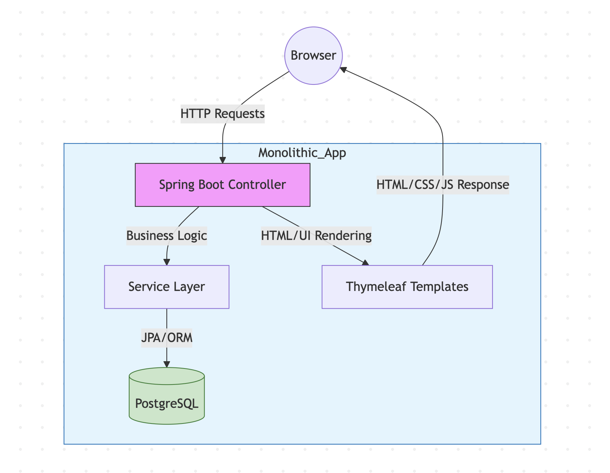

### Authentication Flow


### UML Class Diagram
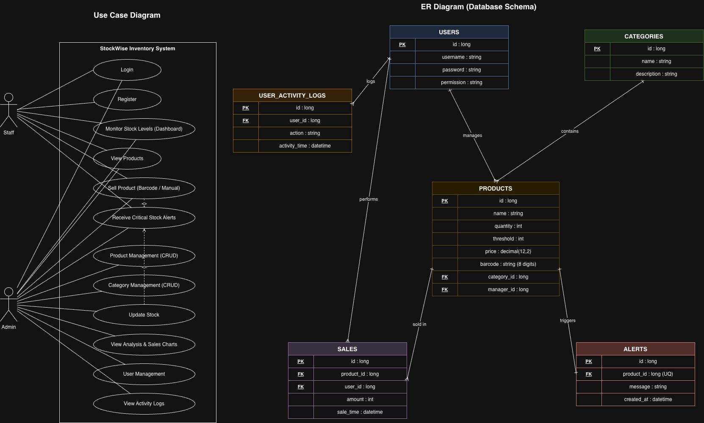

---

## 6) Application Screens

### Authentication

| Login | Register |
|-------|----------|
| 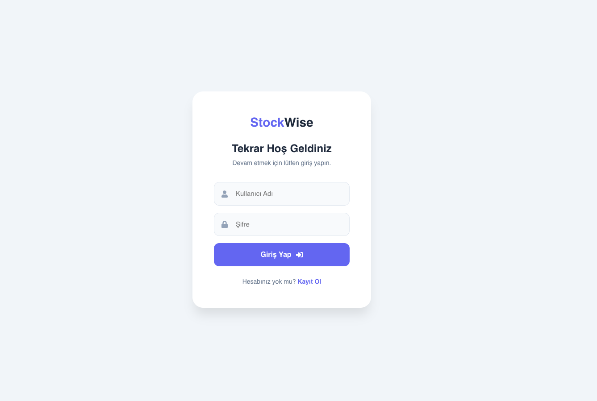 | 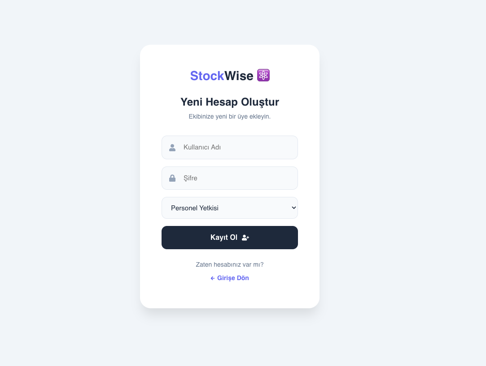 |

Users authenticate through the login page; new accounts are created via the register page where the role (Personel / Yönetici) is selected.

### Staff View (Personel)

Staff users have read-only access to categories and use the product page primarily to perform quick sales via the barcode scanner. The dashboard shows the same KPIs and charts in a simplified, action-restricted interface.

**Dashboard**
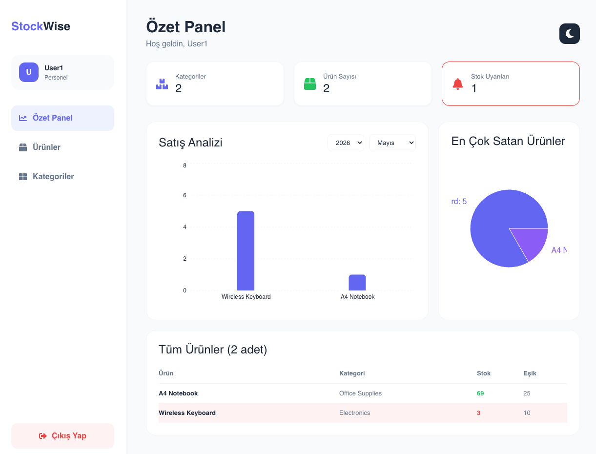

**Products & Quick Sale**
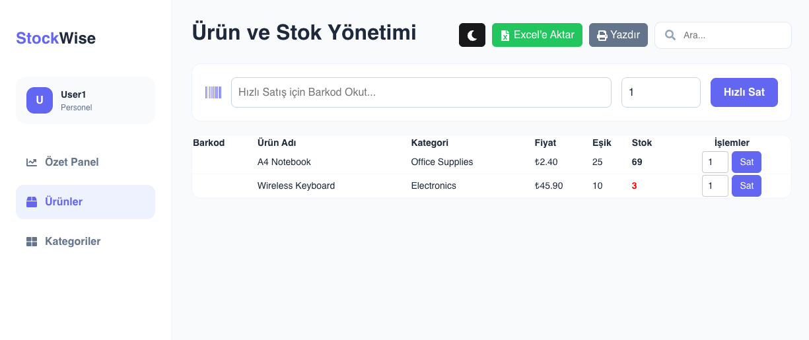

**Categories (read-only)**
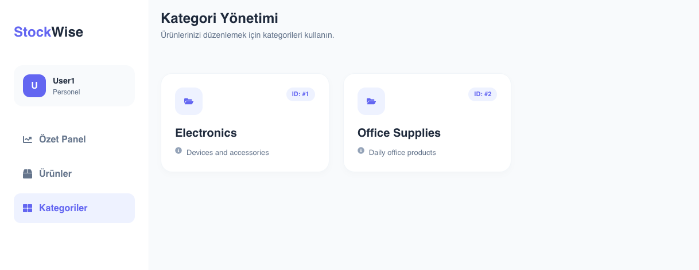

### Admin View (Yönetici)

Admins have full control: they manage categories, add new products, replenish stock, and can delete or edit any record.

**Dashboard**
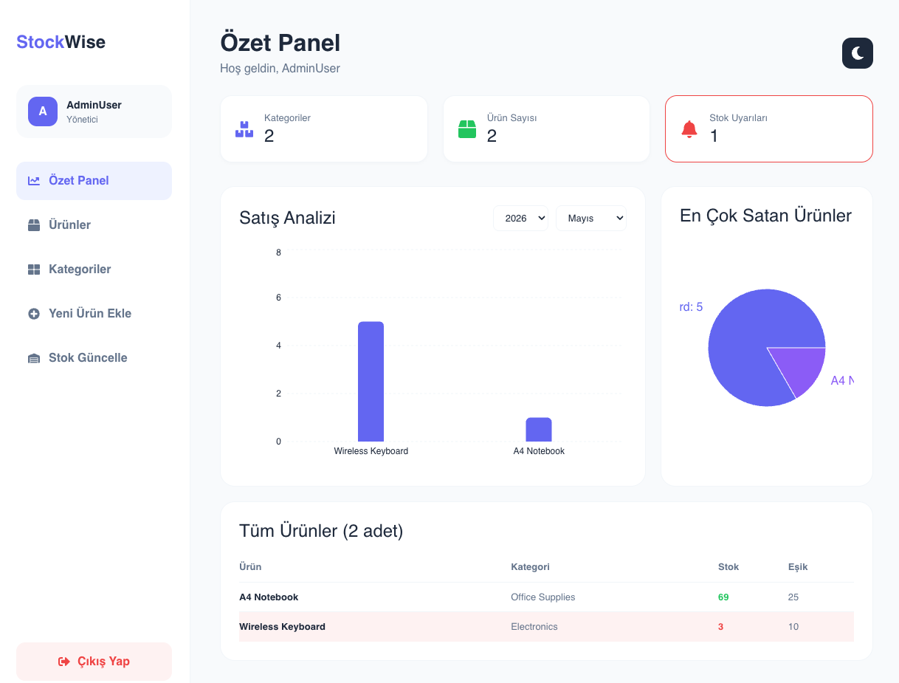

**Products with Edit/Delete**
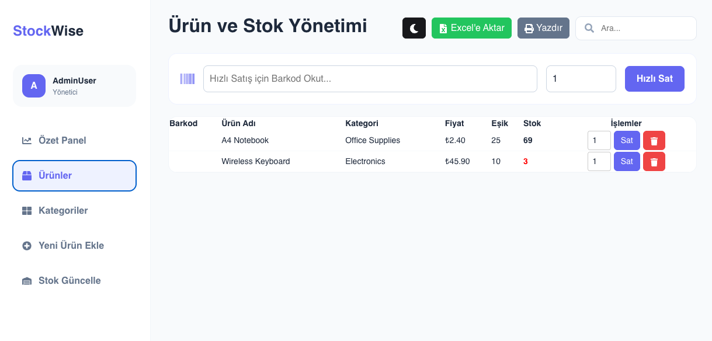

**Category Management (full CRUD)**
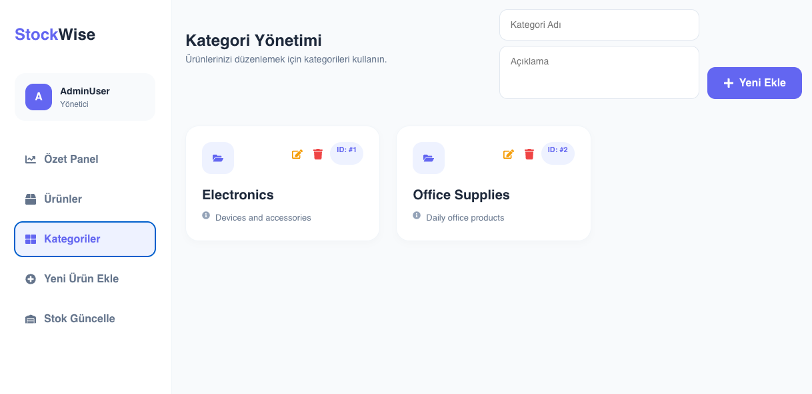

**Add New Product**
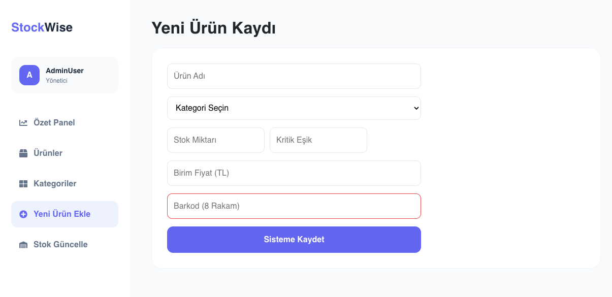

**Stock Replenishment**
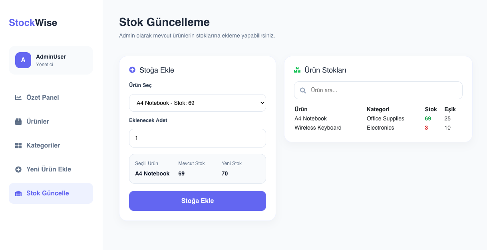

---

## 7) How to Run Locally

### Quick Start (no database setup)

The backend ships with an H2 in-memory database and seed data, so the system can be brought up without installing PostgreSQL.

```bash
# Terminal 1 — Backend
cd backend
mvn spring-boot:run
# → http://localhost:8080

# Terminal 2 — Frontend
cd frontend
npm install
npm start
# → http://localhost:3000
```

Default seeded users:
- **admin / admin** — full access
- **staff / staff** — restricted access

### Prerequisites for Production Setup
- Java JDK 21 — `java -version`
- Maven 3.8+ — `mvn -v`
- Node.js 18+ and npm — `node -v && npm -v`
- PostgreSQL 15+ — `psql --version`

---

## 8) Project Documents

| Document | Purpose |
|----------|---------|
| `Project Overview.pdf` | Goals, scope, and team roles |
| `StockWise-Report.pdf` | Technical task distribution and team-based work breakdown |
| `Software project management.xlsx` | Resource plan and 14-week timeline |
| `StockWise_TechnicalRequirements.pdf` | Functional / non-functional requirements, API and testing requirements |
| `Technology_stack.pdf` | Architectural foundation and backend / data access decisions |
| `Security_architecture.pdf` | Defense layers and security controls |
| `CODE SECURITY AND DATA PRIVACY.pdf` | Secure coding and data privacy principles |
| `Role_and_authorization_management.pdf` | RBAC and authorization policies |
| `Clearance_level_system.pdf` | Role hierarchy and clearance model |
| `StockWise_InstallationDeployment.pdf` | Installation, deployment, troubleshooting |
| `Implementation Roadmap.pdf` | Implementation timeline and milestones |
| `Risk Assessment and Management.pdf` | Identified risks and management approach |
| `Risk Matrix.pdf` | Risk prioritization matrix |
| `Mitigation.pdf` | Mitigation strategies and corrective actions |
| `Validation_and_Testing_Plan.pdf` | Validation approach and test plan |
| `Notification_Delivery_Systems_Research.pdf` | Research on notification delivery options |
| `Payroll.pdf` | Payroll-related role/process documentation |

---

© 2026 StockWise — Built as part of the Software Project Management course.
